<picture><source media="(prefers-color-scheme: dark)" srcset="assets/hero-dark.svg"></picture>

<a href="https://scholar.google.com/citations?user=4OONEVkAAAAJ"><picture><source media="(prefers-color-scheme: dark)" srcset="assets/link-scholar-dark.svg"></picture></a> <a href="https://linkedin.com/in/ips610"><picture><source media="(prefers-color-scheme: dark)" srcset="assets/link-linkedin-dark.svg"></picture></a> <a href="https://orcid.org/0009-0004-8712-7115"><picture><source media="(prefers-color-scheme: dark)" srcset="assets/link-orcid-dark.svg"></picture></a> <a href="mailto:ishpuneetsingh.work@gmail.com"><picture><source media="(prefers-color-scheme: dark)" srcset="assets/link-email-dark.svg"></picture></a> 

 

<a href="https://scholar.google.com/citations?user=4OONEVkAAAAJ"><picture><source media="(prefers-color-scheme: dark)" srcset="assets/work-shadow-dark.svg"></picture></a> <a href="https://huggingface.co/datasets/beacon-gui/BEACON-Dataset"><picture><source media="(prefers-color-scheme: dark)" srcset="assets/work-beacon-dark.svg"></picture></a>

<a href="https://scholar.google.com/citations?user=4OONEVkAAAAJ"><picture><source media="(prefers-color-scheme: dark)" srcset="assets/work-medical-dark.svg"></picture></a> <a href="https://exams.thapar.edu"><picture><source media="(prefers-color-scheme: dark)" srcset="assets/work-thapar-dark.svg"></picture></a>

 

<!-- tools:start -->
<picture><source media="(prefers-color-scheme: dark)" srcset="assets/tools/row0-dark.svg"></picture><picture><source media="(prefers-color-scheme: dark)" srcset="assets/tools/py-dark.svg"></picture><picture><source media="(prefers-color-scheme: dark)" srcset="assets/tools/c-dark.svg"></picture><picture><source media="(prefers-color-scheme: dark)" srcset="assets/tools/cpp-dark.svg"></picture><picture><source media="(prefers-color-scheme: dark)" srcset="assets/tools/java-dark.svg"></picture><picture><source media="(prefers-color-scheme: dark)" srcset="assets/tools/ts-dark.svg"></picture><picture><source media="(prefers-color-scheme: dark)" srcset="assets/tools/js-dark.svg"></picture><picture><source media="(prefers-color-scheme: dark)" srcset="assets/tools/dart-dark.svg"></picture><picture><source media="(prefers-color-scheme: dark)" srcset="assets/tools/php-dark.svg"></picture><picture><source media="(prefers-color-scheme: dark)" srcset="assets/tools/r-dark.svg"></picture><picture><source media="(prefers-color-scheme: dark)" srcset="assets/tools/matlab-dark.svg"></picture><picture><source media="(prefers-color-scheme: dark)" srcset="assets/tools/solidity-dark.svg"></picture><picture><source media="(prefers-color-scheme: dark)" srcset="assets/tools/bash-dark.svg"></picture><picture><source media="(prefers-color-scheme: dark)" srcset="assets/tools/html-dark.svg"></picture><picture><source media="(prefers-color-scheme: dark)" srcset="assets/tools/css-dark.svg"></picture> 
<picture><source media="(prefers-color-scheme: dark)" srcset="assets/tools/row1-dark.svg"></picture><picture><source media="(prefers-color-scheme: dark)" srcset="assets/tools/pytorch-dark.svg"></picture><picture><source media="(prefers-color-scheme: dark)" srcset="assets/tools/tensorflow-dark.svg"></picture><picture><source media="(prefers-color-scheme: dark)" srcset="assets/tools/sklearn-dark.svg"></picture><picture><source media="(prefers-color-scheme: dark)" srcset="assets/tools/opencv-dark.svg"></picture><picture><source media="(prefers-color-scheme: dark)" srcset="assets/tools/si-huggingface-dark.svg"></picture><picture><source media="(prefers-color-scheme: dark)" srcset="assets/tools/si-jupyter-dark.svg"></picture><picture><source media="(prefers-color-scheme: dark)" srcset="assets/tools/si-pandas-dark.svg"></picture><picture><source media="(prefers-color-scheme: dark)" srcset="assets/tools/si-numpy-dark.svg"></picture><picture><source media="(prefers-color-scheme: dark)" srcset="assets/tools/si-kaggle-dark.svg"></picture> 
<picture><source media="(prefers-color-scheme: dark)" srcset="assets/tools/row2-dark.svg"></picture><picture><source media="(prefers-color-scheme: dark)" srcset="assets/tools/react-dark.svg"></picture><picture><source media="(prefers-color-scheme: dark)" srcset="assets/tools/nextjs-dark.svg"></picture><picture><source media="(prefers-color-scheme: dark)" srcset="assets/tools/nodejs-dark.svg"></picture><picture><source media="(prefers-color-scheme: dark)" srcset="assets/tools/tailwind-dark.svg"></picture><picture><source media="(prefers-color-scheme: dark)" srcset="assets/tools/vite-dark.svg"></picture><picture><source media="(prefers-color-scheme: dark)" srcset="assets/tools/threejs-dark.svg"></picture><picture><source media="(prefers-color-scheme: dark)" srcset="assets/tools/flutter-dark.svg"></picture><picture><source media="(prefers-color-scheme: dark)" srcset="assets/tools/firebase-dark.svg"></picture><picture><source media="(prefers-color-scheme: dark)" srcset="assets/tools/flask-dark.svg"></picture><picture><source media="(prefers-color-scheme: dark)" srcset="assets/tools/fastapi-dark.svg"></picture><picture><source media="(prefers-color-scheme: dark)" srcset="assets/tools/selenium-dark.svg"></picture><picture><source media="(prefers-color-scheme: dark)" srcset="assets/tools/supabase-dark.svg"></picture> 
<picture><source media="(prefers-color-scheme: dark)" srcset="assets/tools/row3-dark.svg"></picture><picture><source media="(prefers-color-scheme: dark)" srcset="assets/tools/mysql-dark.svg"></picture><picture><source media="(prefers-color-scheme: dark)" srcset="assets/tools/redis-dark.svg"></picture><picture><source media="(prefers-color-scheme: dark)" srcset="assets/tools/docker-dark.svg"></picture><picture><source media="(prefers-color-scheme: dark)" srcset="assets/tools/linux-dark.svg"></picture><picture><source media="(prefers-color-scheme: dark)" srcset="assets/tools/nginx-dark.svg"></picture><picture><source media="(prefers-color-scheme: dark)" srcset="assets/tools/si-apache-dark.svg"></picture><picture><source media="(prefers-color-scheme: dark)" srcset="assets/tools/gcp-dark.svg"></picture><picture><source media="(prefers-color-scheme: dark)" srcset="assets/tools/vercel-dark.svg"></picture><picture><source media="(prefers-color-scheme: dark)" srcset="assets/tools/cloudflare-dark.svg"></picture><picture><source media="(prefers-color-scheme: dark)" srcset="assets/tools/git-dark.svg"></picture><picture><source media="(prefers-color-scheme: dark)" srcset="assets/tools/githubactions-dark.svg"></picture> 
<picture><source media="(prefers-color-scheme: dark)" srcset="assets/tools/row4-dark.svg"></picture><picture><source media="(prefers-color-scheme: dark)" srcset="assets/tools/latex-dark.svg"></picture><picture><source media="(prefers-color-scheme: dark)" srcset="assets/tools/arduino-dark.svg"></picture><picture><source media="(prefers-color-scheme: dark)" srcset="assets/tools/si-autocad-dark.svg"></picture><picture><source media="(prefers-color-scheme: dark)" srcset="assets/tools/androidstudio-dark.svg"></picture><picture><source media="(prefers-color-scheme: dark)" srcset="assets/tools/vscode-dark.svg"></picture> 
<!-- tools:end -->

 

<!-- activity:start -->
<picture><source media="(prefers-color-scheme: dark)" srcset="assets/activity/stats-dark.svg"></picture> 
<picture><source media="(prefers-color-scheme: dark)" srcset="assets/activity/week-00-dark.svg"></picture><picture><source media="(prefers-color-scheme: dark)" srcset="assets/activity/week-01-dark.svg"></picture><picture><source media="(prefers-color-scheme: dark)" srcset="assets/activity/week-02-dark.svg"></picture><picture><source media="(prefers-color-scheme: dark)" srcset="assets/activity/week-03-dark.svg"></picture><picture><source media="(prefers-color-scheme: dark)" srcset="assets/activity/week-04-dark.svg"></picture><picture><source media="(prefers-color-scheme: dark)" srcset="assets/activity/week-05-dark.svg"></picture><picture><source media="(prefers-color-scheme: dark)" srcset="assets/activity/week-06-dark.svg"></picture><picture><source media="(prefers-color-scheme: dark)" srcset="assets/activity/week-07-dark.svg"></picture><picture><source media="(prefers-color-scheme: dark)" srcset="assets/activity/week-08-dark.svg"></picture><picture><source media="(prefers-color-scheme: dark)" srcset="assets/activity/week-09-dark.svg"></picture><picture><source media="(prefers-color-scheme: dark)" srcset="assets/activity/week-10-dark.svg"></picture><picture><source media="(prefers-color-scheme: dark)" srcset="assets/activity/week-11-dark.svg"></picture><picture><source media="(prefers-color-scheme: dark)" srcset="assets/activity/week-12-dark.svg"></picture><picture><source media="(prefers-color-scheme: dark)" srcset="assets/activity/week-13-dark.svg"></picture><picture><source media="(prefers-color-scheme: dark)" srcset="assets/activity/week-14-dark.svg"></picture><picture><source media="(prefers-color-scheme: dark)" srcset="assets/activity/week-15-dark.svg"></picture><picture><source media="(prefers-color-scheme: dark)" srcset="assets/activity/week-16-dark.svg"></picture><picture><source media="(prefers-color-scheme: dark)" srcset="assets/activity/week-17-dark.svg"></picture><picture><source media="(prefers-color-scheme: dark)" srcset="assets/activity/week-18-dark.svg"></picture><picture><source media="(prefers-color-scheme: dark)" srcset="assets/activity/week-19-dark.svg"></picture><picture><source media="(prefers-color-scheme: dark)" srcset="assets/activity/week-20-dark.svg"></picture><picture><source media="(prefers-color-scheme: dark)" srcset="assets/activity/week-21-dark.svg"></picture><picture><source media="(prefers-color-scheme: dark)" srcset="assets/activity/week-22-dark.svg"></picture><picture><source media="(prefers-color-scheme: dark)" srcset="assets/activity/week-23-dark.svg"></picture><picture><source media="(prefers-color-scheme: dark)" srcset="assets/activity/week-24-dark.svg"></picture><picture><source media="(prefers-color-scheme: dark)" srcset="assets/activity/week-25-dark.svg"></picture><picture><source media="(prefers-color-scheme: dark)" srcset="assets/activity/week-26-dark.svg"></picture><picture><source media="(prefers-color-scheme: dark)" srcset="assets/activity/week-27-dark.svg"></picture><picture><source media="(prefers-color-scheme: dark)" srcset="assets/activity/week-28-dark.svg"></picture><picture><source media="(prefers-color-scheme: dark)" srcset="assets/activity/week-29-dark.svg"></picture><picture><source media="(prefers-color-scheme: dark)" srcset="assets/activity/week-30-dark.svg"></picture><picture><source media="(prefers-color-scheme: dark)" srcset="assets/activity/week-31-dark.svg"></picture><picture><source media="(prefers-color-scheme: dark)" srcset="assets/activity/week-32-dark.svg"></picture><picture><source media="(prefers-color-scheme: dark)" srcset="assets/activity/week-33-dark.svg"></picture><picture><source media="(prefers-color-scheme: dark)" srcset="assets/activity/week-34-dark.svg"></picture><picture><source media="(prefers-color-scheme: dark)" srcset="assets/activity/week-35-dark.svg"></picture><picture><source media="(prefers-color-scheme: dark)" srcset="assets/activity/week-36-dark.svg"></picture><picture><source media="(prefers-color-scheme: dark)" srcset="assets/activity/week-37-dark.svg"></picture><picture><source media="(prefers-color-scheme: dark)" srcset="assets/activity/week-38-dark.svg"></picture><picture><source media="(prefers-color-scheme: dark)" srcset="assets/activity/week-39-dark.svg"></picture><picture><source media="(prefers-color-scheme: dark)" srcset="assets/activity/week-40-dark.svg"></picture><picture><source media="(prefers-color-scheme: dark)" srcset="assets/activity/week-41-dark.svg"></picture><picture><source media="(prefers-color-scheme: dark)" srcset="assets/activity/week-42-dark.svg"></picture><picture><source media="(prefers-color-scheme: dark)" srcset="assets/activity/week-43-dark.svg"></picture><picture><source media="(prefers-color-scheme: dark)" srcset="assets/activity/week-44-dark.svg"></picture><picture><source media="(prefers-color-scheme: dark)" srcset="assets/activity/week-45-dark.svg"></picture><picture><source media="(prefers-color-scheme: dark)" srcset="assets/activity/week-46-dark.svg"></picture><picture><source media="(prefers-color-scheme: dark)" srcset="assets/activity/week-47-dark.svg"></picture><picture><source media="(prefers-color-scheme: dark)" srcset="assets/activity/week-48-dark.svg"></picture><picture><source media="(prefers-color-scheme: dark)" srcset="assets/activity/week-49-dark.svg"></picture><picture><source media="(prefers-color-scheme: dark)" srcset="assets/activity/week-50-dark.svg"></picture><picture><source media="(prefers-color-scheme: dark)" srcset="assets/activity/week-51-dark.svg"></picture><picture><source media="(prefers-color-scheme: dark)" srcset="assets/activity/week-52-dark.svg"></picture> 
<picture><source media="(prefers-color-scheme: dark)" srcset="assets/activity/months-dark.svg"></picture>
<!-- activity:end -->
