<picture>
  <source media="(prefers-color-scheme: dark)" srcset="assets/hero-dark.svg">
  
</picture>

[Google Scholar](https://scholar.google.com/citations?user=4OONEVkAAAAJ) &nbsp;/&nbsp; [LinkedIn](https://linkedin.com/in/ips610) &nbsp;/&nbsp; [ORCID](https://orcid.org/0009-0004-8712-7115) &nbsp;/&nbsp; [Email](mailto:ishpuneetsingh.work@gmail.com) &nbsp;&nbsp; 

 

<a href="https://scholar.google.com/citations?user=4OONEVkAAAAJ"><picture><source media="(prefers-color-scheme: dark)" srcset="assets/work-shadow-dark.svg"></picture></a> <a href="https://huggingface.co/datasets/beacon-gui/BEACON-Dataset"><picture><source media="(prefers-color-scheme: dark)" srcset="assets/work-beacon-dark.svg"></picture></a>

<a href="https://scholar.google.com/citations?user=4OONEVkAAAAJ"><picture><source media="(prefers-color-scheme: dark)" srcset="assets/work-medical-dark.svg"></picture></a> <a href="https://datesheet.thapar.edu"><picture><source media="(prefers-color-scheme: dark)" srcset="assets/work-thapar-dark.svg"></picture></a>

 

<picture>
  <source media="(prefers-color-scheme: dark)" srcset="assets/tools-dark.svg">
  
</picture>

  

<picture>
  <source media="(prefers-color-scheme: dark)" srcset="assets/activity-dark.svg">
  
</picture>
