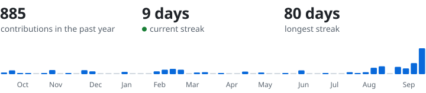

<picture>
  <source media="(prefers-color-scheme: dark)" srcset="assets/hero-dark.svg">
  
</picture>

[Email](mailto:ishpuneetsingh.work@gmail.com) &nbsp;/&nbsp; [LinkedIn](https://linkedin.com/in/ips610) &nbsp;/&nbsp; [ORCID](https://orcid.org/0009-0004-8712-7115) &nbsp;/&nbsp; [BEACON dataset](https://huggingface.co/datasets/beacon-gui/BEACON-Dataset) &nbsp;&nbsp; 

I work on machine learning for security, and on models that people can check. Right now that means a foundation model that spots malware from raw executable bytes, behavioral fingerprints taken from how people play games, and medical models whose reasoning a clinician can inspect and correct.

I'm doing an M.E. in Computer Science and Engineering at Thapar Institute of Engineering and Technology, where I finished a B.E. in Computer Engineering in 2026 with a CGPA of 9.34. I also lead student teams that build software the university runs on: exam scheduling, course feedback and timetabling.

## Research

**Malware detection from raw bytes.** SHADOW is a foundation model trained directly on executable bytes from VirusShare, VirusSign, EMBER and SOREL-20M, plus a hand-curated benign set, so it can recognise malware families it has never seen. With Dr. Maninder Singh, since January 2026.

**Behavioral fingerprints from gameplay.** BEACON is a 445 GB dataset of keystrokes, mouse movement, video and network traffic from 114 players, built to authenticate people continuously while they play. [Dataset](https://huggingface.co/datasets/beacon-gui/BEACON-Dataset) / [Logger](https://zenodo.org/records/20062628) / [Preprint](https://arxiv.org/abs/2605.10867)

**Interpretable medical AI.** Concept bottleneck models that let clinicians see, and correct, the concepts behind a diagnosis. Research intern with Prof. Tim Miller at the University of Queensland, since June 2025.

**Merging large language models.** Compared ways of combining two LLMs and measured what each costs in performance, consistency and efficiency. Research intern (GenAI) at Samsung R&D Institute India, October 2024 to March 2025.

**Federated intrusion detection.** A federated learning setup that flags anomalies in encrypted network traffic while the raw data stays on each node. January to May 2026.

## Publications

- **Predicting Type 2 Diabetes Mellitus Using Fundus Eye Scans: A Deep Learning Approach.** I. Singh, D. Singh, A. Aggarwal, V. Arora. *ICBASE 2025.* Best Oral Presenter award.
- **A Policy-Based Dynamic Cipher Suite for Hybrid Multi-Party Key Agreement.** Neha, I. Singh, T. Bhatia. *SECRYPT 2026.*
- **Quantum Machine Learning for Computing, Communication, and Sensing in 6G Network Scenarios: Current Trends and Future Challenges.** I. Singh, G. Kaur, N. Kumar. *Quantics 2026.*
- **BEACON: A Multimodal Dataset for Learning Behavioral Fingerprints from Gameplay Data.** I. Singh, G. Kaur, U. P. S. Atwal, G. Singh, G. Singh, M. Singh. Preprint, [arXiv:2605.10867](https://arxiv.org/abs/2605.10867).

Data and software: the [BEACON dataset](https://huggingface.co/datasets/beacon-gui/BEACON-Dataset) ([doi:10.5281/zenodo.20034625](https://doi.org/10.5281/zenodo.20034625)) and [BEACON-Logger](https://zenodo.org/records/20062628) ([doi:10.5281/zenodo.20062628](https://doi.org/10.5281/zenodo.20062628)), a Windows tool that records keystrokes, mouse movement and network packets in sync.

Eight more manuscripts under review

- Geometric-Centric Neurosurgery: A Novel Computational Framework for Redefining Optimal Tumor Resection Planes
- Design and Comparative Evaluation of Geometrically Optimized Craniotomy Guides Using Three-Dimensional Printed Models for Resource-Limited Healthcare
- Fundus-based Prediction of Ischaemic Heart Disease: Systematic Evaluation of Transformer Architectures with Image Restoration Preprocessing Techniques
- Temporal Feature Engineering for Wearable-Based Blood Glucose Prediction
- FT-Transformer for IIoT: Resilient Federated Learning and Targeted Federated Unlearning in Tabular Intrusion Detection
- MAST-Net: A Mask-Guided Spatio-Temporal Network for Deepfake Detection
- Stale by Design: Temporal Entity Drift in Biomedical Named Entity Recognition Across Encoder and Generative Language Model Families
- Zero-Shot Forecasting Across Dataset Typologies: Evaluating Time Series Foundation Models via Unsupervised Clustering

## Built for Thapar

**[Datesheet Generator](https://datesheet.thapar.edu).** Builds the university's exam datesheets, invigilation duties and seating plans, and stays in sync with the ERP. It cut scheduling time by more than 95%. Team lead since 2024.

**Feedback app.** A Flutter app with a MySQL backend that collects course feedback from more than 10,000 students, with a live analytics dashboard. Team lead, 2023 to 2024.

**Timetable generator.** Schedules classes with a genetic algorithm that balances hard and soft constraints, with a React front end and a LAMP back end. Funded by a US$17,000 grant; student team lead since 2024.

## Toolbox

<table>
  <tr>
    <td>Languages</td>
    <td><picture><source media="(prefers-color-scheme: dark)" srcset="assets/stack-languages-dark.svg"></picture></td>
  </tr>
  <tr>
    <td>Machine learning</td>
    <td><picture><source media="(prefers-color-scheme: dark)" srcset="assets/stack-ml-dark.svg"></picture></td>
  </tr>
  <tr>
    <td>Apps and web</td>
    <td><picture><source media="(prefers-color-scheme: dark)" srcset="assets/stack-apps-dark.svg"></picture></td>
  </tr>
  <tr>
    <td>Infrastructure</td>
    <td><picture><source media="(prefers-color-scheme: dark)" srcset="assets/stack-infra-dark.svg"></picture></td>
  </tr>
</table>

## Activity

<picture>
  <source media="(prefers-color-scheme: dark)" srcset="assets/activity-dark.svg">
  
</picture>

## Recognition

- Best Oral Presenter, ICBASE 2025
- Top 30 national finalists out of 8,500+ teams, Bharatiya Antariksh Hackathon 2025 (ISRO)
- Judge and mentor, SabkaAI Innovation Challenge 2026: AI for Inclusion
- Selected for Amazon ML Summer School 2024
- Merit scholarship from Thapar, four years running
- Member of the Student Consultative Committee, 2025–26, and Technical Secretary of the OWASP Student Chapter
- Top 300 in the North Region, Pre-Regional Mathematics Olympiad

The quickest way to reach me is [email](mailto:ishpuneetsingh.work@gmail.com).
